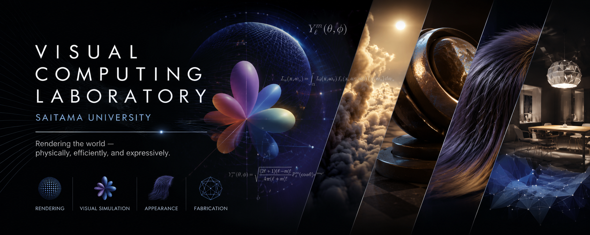

<!-- Replace this with a laboratory banner later -->

# Visual Computing Laboratory

### Rendering the world — physically, efficiently, and expressively.

**Saitama University · Japan**

---

## About Us

The **Visual Computing Laboratory (VCL)** at Saitama University develops
new algorithms for computer graphics and visual computing.

Our research explores mathematical and computational methods for producing,
representing, and manipulating complex visual phenomena.

## Research

<table>
<tr>
<td width="50%" valign="top">

### ✦ Rendering

- Physically based rendering
- Real-time and offline rendering
- Light transport and shading
- Participating media
- Material appearance

</td>
<td width="50%" valign="top">

### ✦ Visual Computing

- Spherical function representations
- Geometry and animation
- Appearance modeling
- Computational fabrication
- Stylized visualization

</td>
</tr>
</table>

## Featured Resources

### [Spherical Harmonics — CEDEC 2026](https://github.com/vclsu/spherical-harmonics-cedec2026)

Reference implementation and educational resources for spherical harmonics,
prepared for CEDEC 2026.

> More research code, datasets, and supplementary materials will be released here.

## Publications and Projects

Visit our laboratory website for our publications, research projects,
members, and recent news.

  <a href="https://visualcomputing-lab.github.io/">
    <strong>Explore the Visual Computing Laboratory →</strong>
  </a>

---

**Visual Computing Laboratory**  
Graduate School of Science and Engineering  
**Saitama University, Japan**

*Research · Code · Visual Computing*

